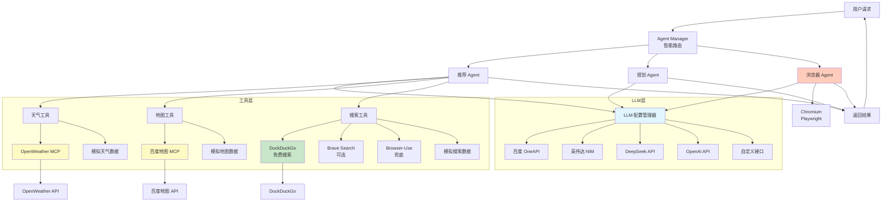
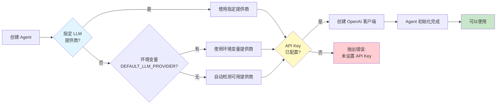
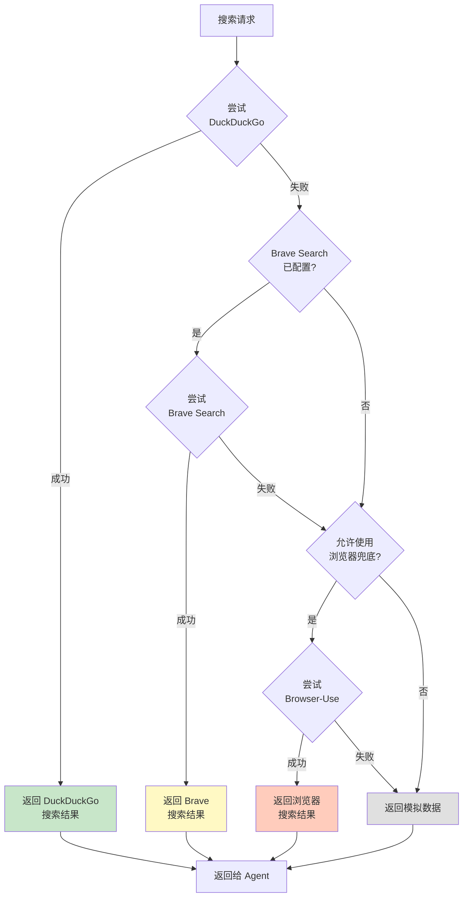
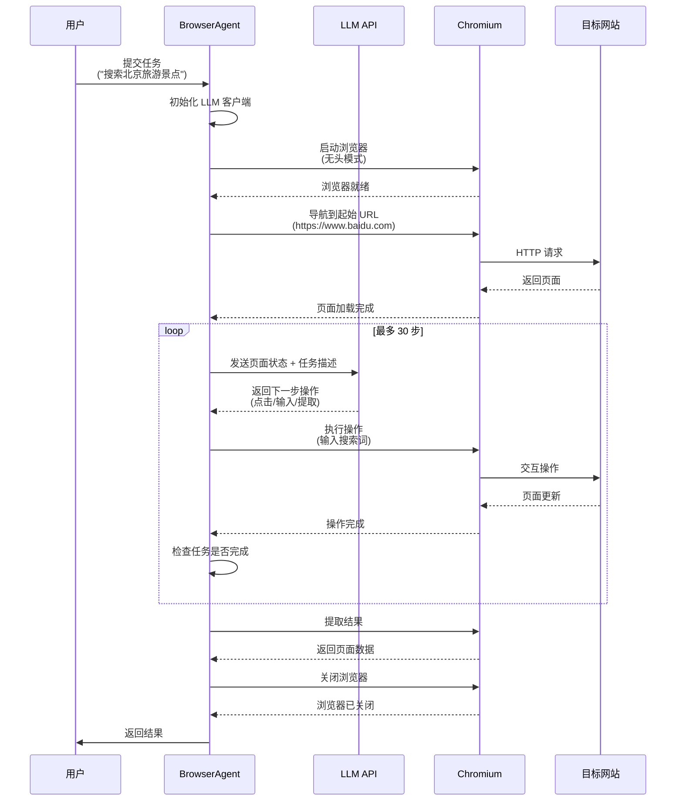
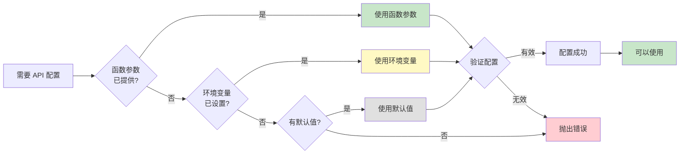
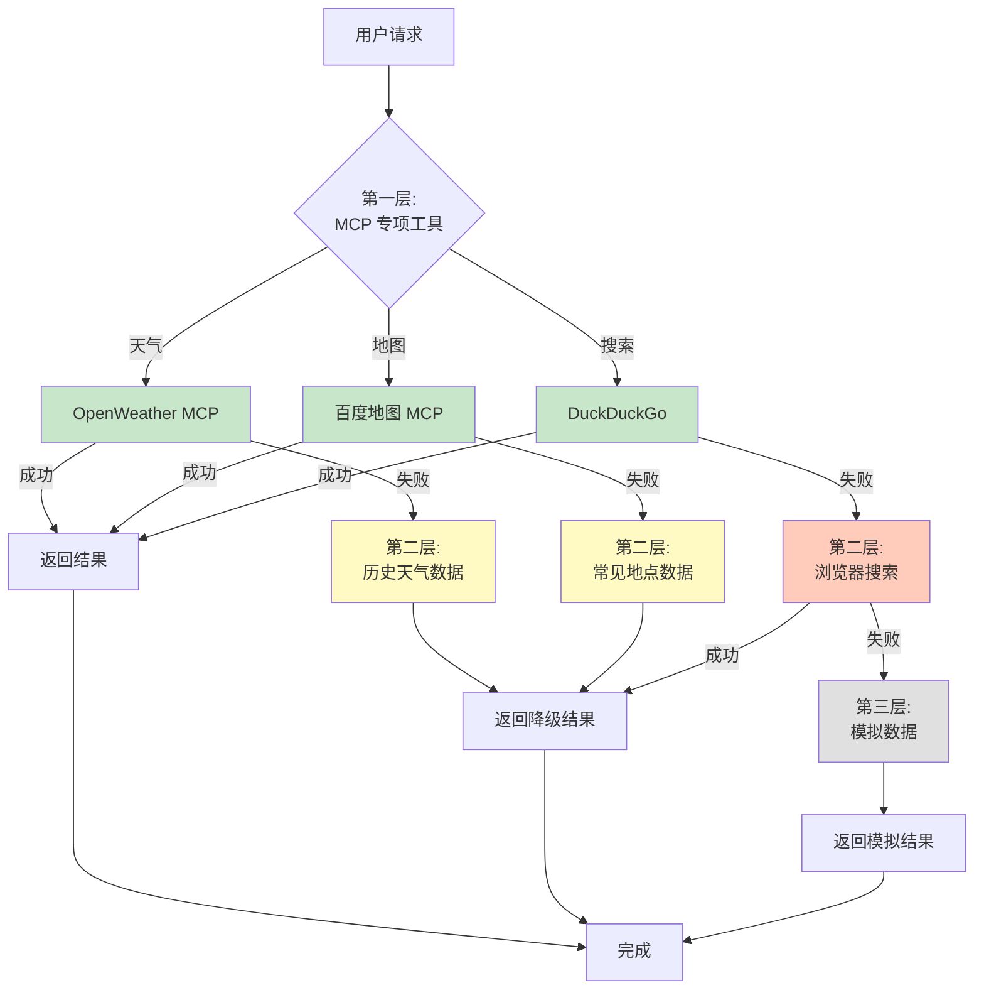
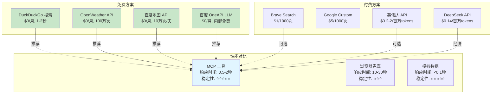
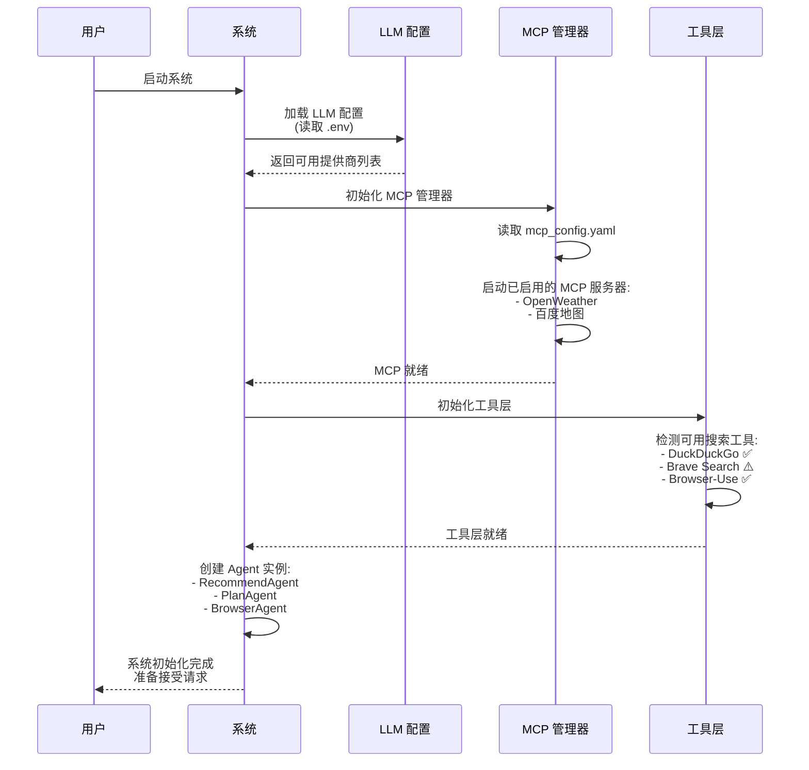
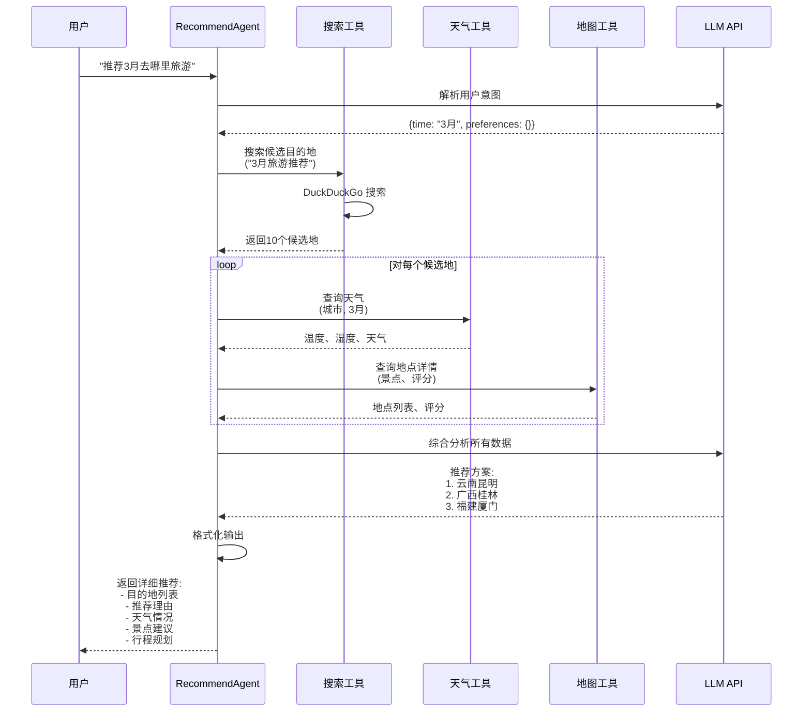

# AI Agent 旅行规划系统 - 完整流程图

## 1. 系统总体架构流程图



---

## 2. LLM 配置选择流程图



---

## 3. 搜索工具智能降级流程图



---

## 4. BrowserAgent 执行流程图



---

## 5. 旅行推荐 Agent 完整流程图

```mermaid
graph TB
    UserInput[用户输入<br/>"推荐3月旅游目的地"] --> ParseIntent[解析用户意图]

    ParseIntent --> ExtractInfo[提取关键信息:<br/>- 时间: 3月<br/>- 偏好: 未指定]

    ExtractInfo --> SearchDest{搜索目的地}

    SearchDest --> TrySearch1[尝试 DuckDuckGo 搜索]
    TrySearch1 -->|成功| GetSearchResults[获取候选目的地]
    TrySearch1 -->|失败| TrySearch2[尝试 Brave Search]
    TrySearch2 -->|成功| GetSearchResults
    TrySearch2 -->|失败| TrySearch3[浏览器搜索]
    TrySearch3 --> GetSearchResults

    GetSearchResults --> CheckWeather{查询天气信息}

    CheckWeather --> TryWeather1[尝试 OpenWeather MCP]
    TryWeather1 -->|成功| GetWeatherData[获取天气数据]
    TryWeather1 -->|失败| UseWeatherMock[使用历史天气数据]
    UseWeatherMock --> GetWeatherData

    GetWeatherData --> QueryMap{查询地点信息}

    QueryMap --> TryMap1[尝试百度地图 MCP]
    TryMap1 -->|成功| GetMapData[获取地点详情]
    TryMap1 -->|失败| UseMapMock[使用模拟地点数据]
    UseMapMock --> GetMapData

    GetMapData --> AnalyzeData[LLM 分析综合数据:<br/>- 天气适宜度<br/>- 景点评分<br/>- 交通便利性<br/>- 性价比]

    AnalyzeData --> GenerateRec[生成推荐方案:<br/>1. 目的地列表<br/>2. 推荐理由<br/>3. 行程建议<br/>4. 注意事项]

    GenerateRec --> FormatOutput[格式化输出]

    FormatOutput --> ReturnToUser[返回给用户]

    style GetSearchResults fill:#c8e6c9
    style GetWeatherData fill:#c8e6c9
    style GetMapData fill:#c8e6c9
    style GenerateRec fill:#e1f5ff
```

---

## 6. API 配置优先级流程图



---

## 7. 多层降级策略总览



---

## 8. 成本与性能对比流程



---

## 9. 系统初始化流程



---

## 10. 完整请求处理时序图



---

## 使用说明

1. **总体架构流程图**：展示整个系统的层次结构
2. **LLM 配置选择流程图**：说明如何选择和配置 LLM
3. **搜索工具智能降级流程图**：展示搜索工具的降级策略
4. **BrowserAgent 执行流程图**：浏览器自动化的详细步骤
5. **旅行推荐 Agent 完整流程图**：推荐功能的完整实现
6. **API 配置优先级流程图**：配置参数的优先级规则
7. **多层降级策略总览**：系统的降级保障机制
8. **成本与性能对比流程**：免费 vs 付费方案对比
9. **系统初始化流程**：系统启动时的初始化过程
10. **完整请求处理时序图**：用户请求的完整处理流程

这些流程图可以使用支持 Mermaid 的工具查看，如：
- GitHub/GitLab（直接渲染）
- VS Code（安装 Mermaid 插件）
- 在线工具：https://mermaid.live/
